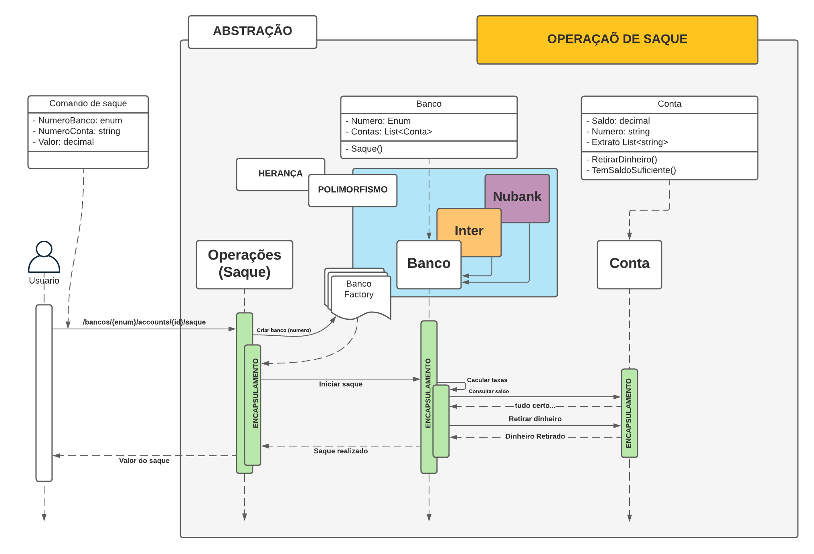

## Programação orientado objetos na prática
---

Não clique aqui: https://bit.ly/3DaDlbG

Sem sombras de dúvidas, você deveria conhecer o paradigma de orientação objetos, pois o mesmo é o mais utilizado quando o assunto é : abstrair objetos do mundo real para transformar em código 🧑‍💻 

Nesse vídeo eu vou te explicar o que é programação orientado objetos da sigla (POO) e quais são as técnicas que eu utilizo para transformar uma ideia em uma funcionalidade utilizando c# 🚀

Além disso vou mostrar na prática como os 4 pilares da POO que são eles: abstração, encapsulamento, herança e polimorfismo trabalham juntos, para alçar um único resultado. 🎯

Um código com poucos acoplamentos, expressivo e com boas regras definidas 🤯

Já deixa aquele comentário, dizendo se você já dominava ou não esse paradigma, e não deixe de compartilhar com seus amigos 🙏

links: https://ezbio.online/geandeveloper

